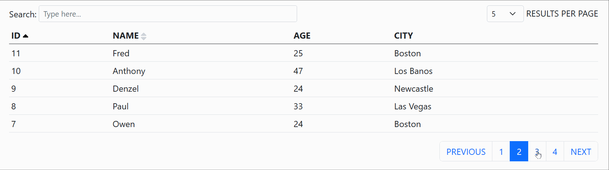

# svelte-datatables-net

    [](https://twitter.com/joaquimnetocel)

**svelte-datatables-net** is a svelte/sveltekit component that turns data into an interactive HTML table. Inspired by datatables.net.



## FEATURES

- POSSIBILITY OF CHOOSING THE SEARCHABLE COLUMNS.
- POSSIBILITY OF CHOOSING THE SORTABLE COLUMNS.
- PAGINATION.
- POSSIBILITY OF CHOOSING AND CHANGING THE NUMBER OF ROWS PER PAGE.
- NON-OPINIONATED STYLING.
- NON-OPINIONATED POSITIONING.
- TYPESCRIPT SUPPORT.

## DEMOS

- [REPL: BOOTSTRAP 5 EXAMPLE](https://svelte.dev/repl/d5a7803dd61041b0b6e0d0efcd743580)
- [REPL: SKELETON EXAMPLE](https://svelte.dev/repl/b2e43168303f4f1ba67c84a0c3c0fea0)
- [REPL: FETCH EXAMPLE](https://svelte.dev/repl/755b541084534ad9b507e37af2e4c218)

## INSTALLATION

```bash
npm install svelte-datatables-net
```

## COMPONENT STRUCTURE

- `functionCreateDatatable`: A function to create an object with all the states of the component.
- `Engine`: This is a hidden component (it won't display anything on the screen). However, it is critical for the other components to work together. You must always use it!
- `Search`: A svelte component with a search input.
- `RowsPerPage`: A svelte component with a select input to choose the number of rows per page.
- `Pagination`: A svelte component to change the active page.
- `Sort`: A svelte component that enable sorting for a specific column.
- `typeDatatable`: If you are using typescript, it is a type definition for the component states.

## PARAMETERS AND PROPS

- PARAMETERS OF `functionCreateDatatable`:

| PARAMETER | DESCRIPTION | TYPE | REQUIRED | DEFAULT |
| - | - | - | - | - |
| `parData` | AN ARRAY WITH THE DATA. | `Generic[]` | YES | - |
| `parSearchableColumns` | AN ARRAY WITH THE SEARCHABLE COLUMNS (KEYS OF `parData`). |`(keyof Generic)[]` | NO | `undefined` |
| `parSearchString` | THE SEARCH STRING CAN BE SET PREVIOUSLY WITH THIS PROP. | `string` | NO | `''` (EMPTY STRING)
| `parRowsPerPage` | THE INITIAL NUMBER OF ROWS PER PAGE. | `string` (NUMERIC STRING OR `'all'`) | NO | `'all'`
| `parSortBy` | THE INITIAL SORT COLUMN (A KEY OF `parData`). | `keyof Generic` | NO | `undefined` (NO INITIAL SORTING)
| parSortOrder | THE INITIAL SORT ORDER | 'ascending' OR 'descending' | NO | 'ascending' |
| `parSortFunction` | A COMPARE FUNCTION THAT SPECIFIES THE INITIAL SORT ORDER. ([MORE DETAILS HERE](https://developer.mozilla.org/en-US/docs/Web/JavaScript/Reference/Global_Objects/Array/sort)) | (a: Generic, b: Generic) => number | NO | A STANDARD FUNCTION TO SORT ALPHABETICALLY.

- PROPS OF `Engine`:

| PROP | DESCRIPTION | TYPE | REQUIRED | DEFAULT |
| - | - | - | - | - |
| `propDatatable` | AN OBJECT WITH THE DATATABLE STATES (OBJECT CREATED WITH `functionCreateDatatable`) | `typeDatatable<Generic>` | YES | - |

- PROPS OF `Search`:

| PROP | DESCRIPTION | TYPE | REQUIRED | DEFAULT |
| - | - | - | - | - |
| `propDatatable` | AN OBJECT WITH THE DATATABLE STATES (OBJECT CREATED WITH `functionCreateDatatable`) | `typeDatatable<Generic>` | YES | - |
| `propPlaceholder` | SEARCH INPUT PLACEHOLDER. | `string` | NO | 'Type here...' |

- PROPS OF `RowsPerPage`:

| PROP | DESCRIPTION | TYPE | REQUIRED | DEFAULT |
| - | - | - | - | - |
| `propDatatable` | AN OBJECT WITH THE DATATABLE STATES (OBJECT CREATED WITH `functionCreateDatatable`) | `typeDatatable<Generic>` | YES | - |

- PROPS OF `Pagination`:

| PROP | DESCRIPTION | TYPE | REQUIRED | DEFAULT |
| - | - | - | - | - |
| `propDatatable` | AN OBJECT WITH THE DATATABLE STATES (OBJECT CREATED WITH `functionCreateDatatable`) | `typeDatatable<Generic>` | YES | - |
| OTHER PROPS... | SEE [THIS](https://www.npmjs.com/package/pagination-svelte). | - | NO | - |

- PROPS OF `Sort`:

| PROP | DESCRIPTION | TYPE | REQUIRED | DEFAULT |
| - | - | - | - | - |
| `propDatatable` | AN OBJECT WITH THE DATATABLE STATES (OBJECT CREATED WITH `functionCreateDatatable`) | `typeDatatable<Generic>` | YES | - |
| `propIconSize` | SIZE OF THE SORT ICON  | `number` | NO | 10 |

## EXAMPLES

- SKELETON EXAMPLE:

```svelte
<script>
    import { Engine, functionCreateDatatable, Pagination, RowsPerPage, Search, Sort } from 'svelte-datatables-net';

    const arrayUsers = [
        { id: 9, name: 'Denzel', age: 24, city: 'Newcastle' },
        { id: 12, name: 'Olga', age: 35, city: 'Las Cruces' },
        { id: 13, name: 'Barry', age: 27, city: 'Newport' },
        { id: 10, name: 'Anthony', age: 47, city: 'Los Banos' },
        { id: 2, name: 'Mary', age: 45, city: 'Los Angeles' },
        { id: 1, name: 'John', age: 21, city: 'New York' },
        { id: 3, name: 'Mark', age: 23, city: 'Boston' },
        { id: 5, name: 'Brian', age: 22, city: 'New Orleans' },
        { id: 14, name: 'Larry', age: 41, city: 'Los Altos' },
        { id: 4, name: 'Cris', age: 32, city: 'Las Vegas' },
        { id: 6, name: 'Stuart', age: 46, city: 'Los Gatos' },
        { id: 7, name: 'Owen', age: 24, city: 'Boston' },
        { id: 8, name: 'Paul', age: 33, city: 'Las Vegas' },
        { id: 11, name: 'Fred', age: 25, city: 'Boston' },
        { id: 15, name: 'Richard', age: 29, city: 'Boston' },
        { id: 16, name: 'Bruna', age: 31, city: 'Las Vegas' }
    ];

    let objectDatatable = functionCreateDatatable({
        parData: arrayUsers,
        parSearchableColumns: ['name', 'city'],
        parRowsPerPage: '5',
        parSearchString: '',
        parSortBy: 'city',
        parSortOrder: 'ascending'
    });
</script>

<Engine bind:propDatatable={objectDatatable} />

<p>
    <span>Search:</span>
    <Search bind:propDatatable={objectDatatable} propPlaceholder="Type here..." />
</p>
<p>
    <RowsPerPage bind:propDatatable={objectDatatable}>
        <option value="5">5</option>
        <option value="10">10</option>
        <option value="20">20</option>
        <option value="30">30</option>
        <option value="all">ALL</option>
    </RowsPerPage>
    <span>RESULTS PER PAGE</span>
</p>
<p>
    <Pagination bind:propDatatable={objectDatatable} propSize="small" />
</p>

<table>
    <thead>
        <tr>
            <th><Sort bind:propDatatable={objectDatatable} propColumn={'id'}>ID (click here)</Sort></th>
            <th><Sort bind:propDatatable={objectDatatable} propColumn={'name'}>NAME (click here)</Sort>
            </th>
            <th>AGE</th>
            <th>CITY</th>
        </tr>
    </thead>
    <tbody>
        {#each objectDatatable.arrayData as row}
            <tr>
                <td>{row.id}</td>
                <td>{row.name}</td>
                <td>{row.age}</td>
                <td>{row.city}</td>
            </tr>
        {/each}
    </tbody>
</table>
```

- FETCH EXAMPLE (WITH TYPESCRIPT)

```svelte
<script lang="ts">
    import type { typeDatatable } from 'svelte-datatables-net';
    import { Engine, functionCreateDatatable, Pagination, RowsPerPage, Search, Sort } from 'svelte-datatables-net';

    type typeData = {
        brand: string;
        category: string;
        description: string;
        discountPercentage: number;
        id: number;
        images: string[];
        price: number;
        rationg: number;
        stock: number;
        thumbnail: string;
        title: string;
    };

    let objectDatatable: typeDatatable<typeData>;

    const functionReadData = async function () {
        const responseData = await fetch('https://dummyjson.com/products');
        const jsonData = await responseData.json();
        const arrayData = jsonData.products as typeData[];
        objectDatatable = functionCreateDatatable({
            parData: arrayData,
            parSearchableColumns: ['id', 'brand', 'category', 'description'],
            parRowsPerPage: '10',
            parSearchString: '',
            parSortBy: 'id',
            parSortOrder: 'ascending'
        });
    };
</script>

{#await functionReadData()}
    READING DATA...
{:then}
    <Engine bind:propDatatable={objectDatatable} />

    <p>
        <span>Search:</span>
        <Search bind:propDatatable={objectDatatable} propPlaceholder="Type here..." />
    </p>
    <p>
        <RowsPerPage bind:propDatatable={objectDatatable}>
            <option value="5">5</option>
            <option value="10">10</option>
            <option value="20">20</option>
            <option value="30">30</option>
            <option value="all">ALL</option>
        </RowsPerPage>
        <span>RESULTS PER PAGE</span>
    </p>
    <p>
        <Pagination bind:propDatatable={objectDatatable} propSize="small" />
    </p>

    <table>
        <thead>
            <tr>
                <th>
                    <Sort bind:propDatatable={objectDatatable} propColumn={'id'}>ID (click here)</Sort
                    >
                </th>
                <th>
                    <Sort bind:propDatatable={objectDatatable} propColumn={'brand'}
                        >BRAND (click here)</Sort
                    >
                </th>
                <th>CATEGORY</th>
                <th>DESCRIPTION</th>
                <th>STOCK</th>
            </tr>
        </thead>
        <tbody>
            {#each objectDatatable.arrayData as row}
                <tr>
                    <td>{row.id}</td>
                    <td>{row.brand}</td>
                    <td>{row.category}</td>
                    <td>{row.description}</td>
                    <td>{row.stock}</td>
                </tr>
            {/each}
        </tbody>
    </table>
{/await}
```

- BOOTSTRAP 5 EXAMPLE:

```svelte
<script lang="ts">
    import { Engine, functionCreateDatatable, Pagination, RowsPerPage, Search, Sort } from 'svelte-datatables-net';

    const arrayUsers = [
        { id: 9, name: 'Denzel', age: 24, city: 'Newcastle' },
        { id: 12, name: 'Olga', age: 35, city: 'Las Cruces' },
        { id: 13, name: 'Barry', age: 27, city: 'Newport' },
        { id: 10, name: 'Anthony', age: 47, city: 'Los Banos' },
        { id: 2, name: 'Mary', age: 45, city: 'Los Angeles' },
        { id: 1, name: 'John', age: 21, city: 'New York' },
        { id: 3, name: 'Mark', age: 23, city: 'Boston' },
        { id: 5, name: 'Brian', age: 22, city: 'New Orleans' },
        { id: 14, name: 'Larry', age: 41, city: 'Los Altos' },
        { id: 4, name: 'Cris', age: 32, city: 'Las Vegas' },
        { id: 6, name: 'Stuart', age: 46, city: 'Los Gatos' },
        { id: 7, name: 'Owen', age: 24, city: 'Boston' },
        { id: 8, name: 'Paul', age: 33, city: 'Las Vegas' },
        { id: 11, name: 'Fred', age: 25, city: 'Boston' },
        { id: 15, name: 'Richard', age: 29, city: 'Boston' },
        { id: 16, name: 'Bruna', age: 31, city: 'Las Vegas' }
    ];

    let objectDatatable = functionCreateDatatable({
        parData: arrayUsers,
        parSearchableColumns: ['name', 'city'],
        parRowsPerPage: '5',
        parSearchString: '',
        parSortBy: 'city',
        parSortOrder: 'ascending'
    });
</script>

<svelte:head>
    <link
        href="https://cdn.jsdelivr.net/npm/bootstrap@5.0.2/dist/css/bootstrap.min.css"
        rel="stylesheet"
        integrity="sha384-EVSTQN3/azprG1Anm3QDgpJLIm9Nao0Yz1ztcQTwFspd3yD65VohhpuuCOmLASjC"
        crossorigin="anonymous"
    />
</svelte:head>

<Engine bind:propDatatable={objectDatatable} />

<div class="container-sm">
    <div class="mx-3">
        <!-- SEARCH & RESULTS PER PAGE -->
        <div class="row align-items-center mb-2">
            <div class="col-12 col-md-6 text-md-start text-center mb-1 mb-md-0">
                <div class="d-md-flex align-items-md-center">
                    <span class="me-1">Search:</span>
                    <Search 
                        bind:propDatatable={objectDatatable} 
                        propPlaceholder="Type here..." 
                        class="form-control form-control-sm"
                    />
                </div>
            </div>
            <div class="col-12 col-md-6 text-md-end text-center">
                <RowsPerPage
                    bind:propDatatable={objectDatatable}
                    class="d-inline form-select form-select-sm w-auto"
                >
                    <option value="5">5</option>
                    <option value="10">10</option>
                    <option value="20">20</option>
                    <option value="30">30</option>
                    <option value="all">ALL</option>
                </RowsPerPage>
                <span>RESULTS PER PAGE</span>
            </div>
        </div>
        <!---->
        {#if objectDatatable.arraySearched.length === 0}
            <div class="text-center mt-5"><strong>NO RECORDS FOUND.</strong></div>
        {:else}
            <!-- TABLE -->
            <table class="table table-striped table-sm mt-2">
                <thead>
                    <tr>
                        <th>
                            <Sort bind:propDatatable={objectDatatable} propColumn={'id'}>ID</Sort>
                        </th>
                        <th>
                            <Sort bind:propDatatable={objectDatatable} propColumn={'name'}>NAME</Sort>
                        </th>
                        <th>AGE</th>
                        <th>CITY</th>
                    </tr>
                </thead>
                <tbody>
                    {#each objectDatatable.arrayData as row}
                        <tr>
                            <td>{row.id}</td>
                            <td>{row.name}</td>
                            <td>{row.age}</td>
                            <td>{row.city}</td>
                        </tr>
                    {/each}
                </tbody>
            </table>
            <!---->
            <!-- PAGINATION -->
            <div class="d-flex justify-content-center justify-content-md-end mb-5">
                <Pagination bind:propDatatable={objectDatatable} propSize="default" />
            </div>
            <!---->
        {/if}
    </div>
</div>
```

## DEVELOPING

Once you've created a project and installed dependencies with `npm install`, start a development server:

```bash
npm run dev
```
